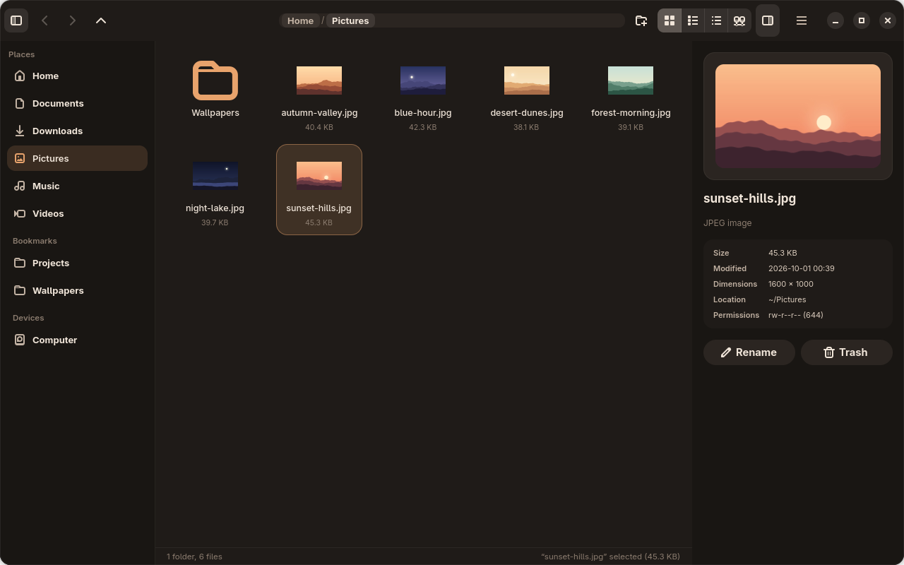
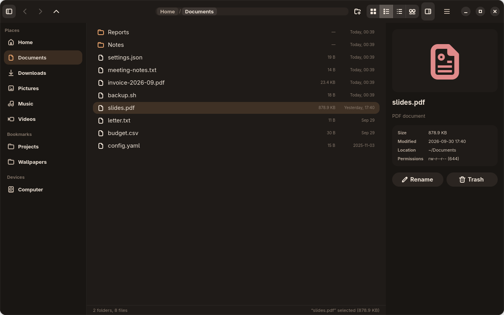
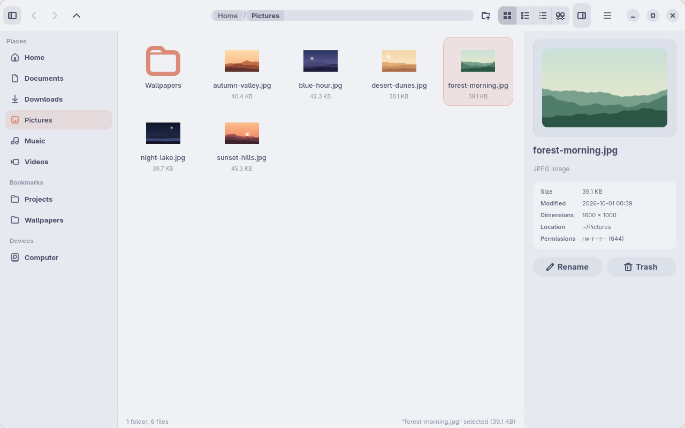
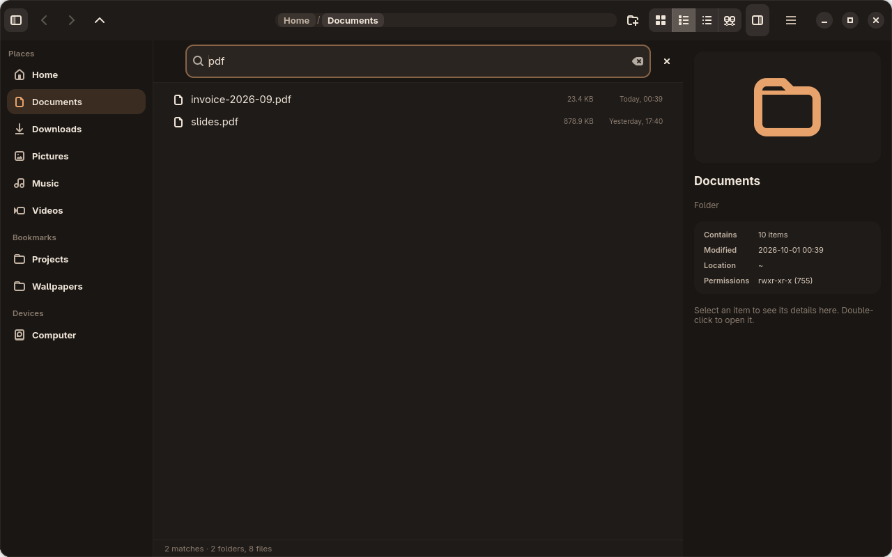
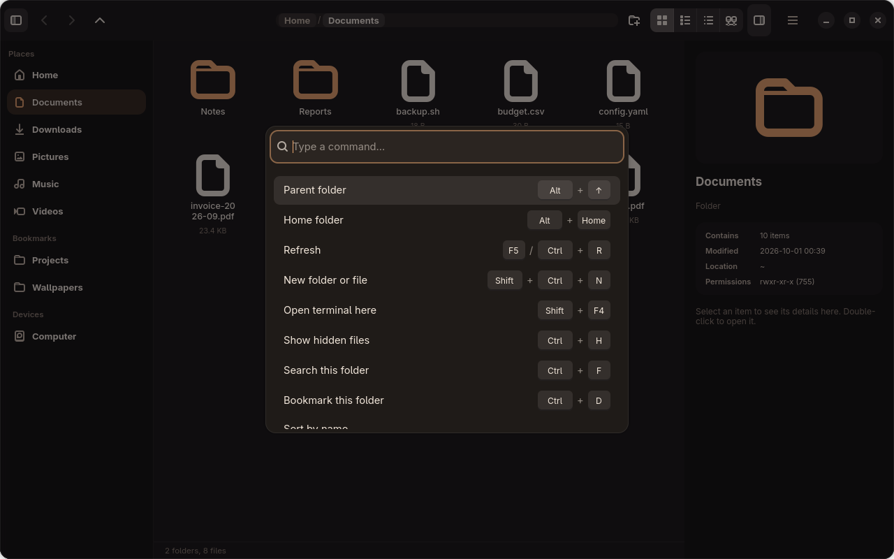
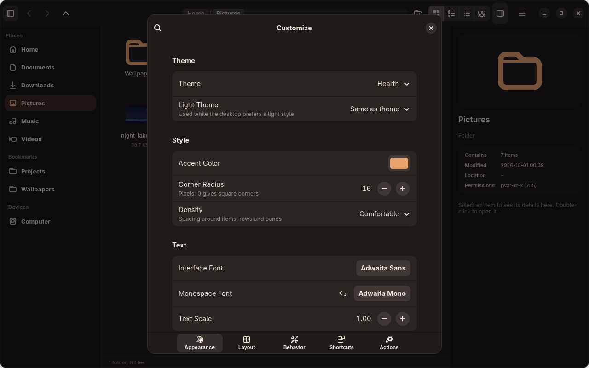
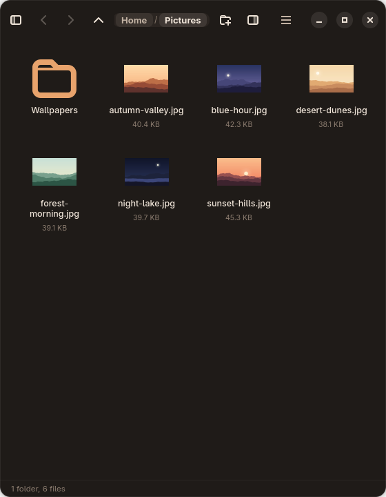

# Diptych

A calm, keyboard-friendly file manager for Linux, written in Rust with GTK 4 and libadwaita.

Diptych shows a folder on the left and the item you selected in an inspector on the right, like the
two panels of a diptych. It follows your desktop on GNOME, KDE Plasma and tiling compositors such as
Hyprland. You can change almost everything about it from the Customize dialog or from plain text
files that apply as soon as you save them.



## Features

**Browsing**
- Grid, list, tree and graph views. The grid and list are virtualized, so folders with tens of
  thousands of files stay smooth, and they update live as files change on disk.
- An inspector with a preview, file details and quick actions for the selected item, or a summary
  when several items are selected.
- Search the current folder with `Ctrl+F`, or just start typing.
- Sort by name, size, modified date or type, in either direction. Folders always come first.
- Back and forward history, a clickable path bar, and a status bar with item counts and the size of
  the selection.
- Bookmarks, shared with Nautilus and the GTK file chooser.

**Working with files**
- Copy, cut and paste with the clipboard formats other file managers use, so files move freely
  between Diptych, Nautilus, Dolphin and your terminal.
- Drag and drop in both directions. Dropping on a folder moves the files into it.
- Transfers never overwrite anything: a name clash becomes `notes (2).txt`.
- Items go to the trash by default; permanent deletion always asks first.
- Errors appear as short messages in the window instead of disappearing into a log.

**Making it yours**
- Nine built-in themes, including the warm default *Hearth* and the light *Cozy Latte*, plus your own
  themes in TOML. Light and dark can follow the desktop.
- `user.css` for anything the theme tokens don't cover.
- `layout.toml` controls which panes are shown, their width and side, the header bar items, the
  inspector fields and the window decorations.
- Every shortcut can be rebound, and your own commands ("Convert to PNG", "Open in VS Code") appear
  in the right-click menu and the command palette.
- Everything above is also available in the **Customize** dialog (`Ctrl+,`), which writes back to
  the same files and keeps your comments.

**Fitting into the desktop**
- Window buttons follow your desktop's button layout; tiling compositors get a header bar without
  them.
- Responsive layout: on half- and quarter-screen tiles the inspector, then the sidebar, fold away.
- Translucent themes, so Hyprland and KWin blur show through.
- Can be the default file manager, including "Show in folder" from browsers
  (`org.freedesktop.FileManager1`), and opens your preferred terminal.

## Screenshots

| | |
|---|---|
|  |  |
| List view, newest first | *Cozy Latte*, the light theme |
|  |  |
| Search as you type | Command palette (`Ctrl+Shift+P`) |
|  |  |
| Customize dialog (`Ctrl+,`) | A narrow tile: the panes fold away |

## Installation

Diptych needs GTK 4.12 or newer and libadwaita 1.5 or newer.

1. Install the build dependencies:

   | Distribution | Command |
   |---|---|
   | Arch Linux | `sudo pacman -S gtk4 libadwaita base-devel` |
   | Fedora | `sudo dnf install gtk4-devel libadwaita-devel gcc` |
   | Debian, Ubuntu | `sudo apt install libgtk-4-dev libadwaita-1-dev build-essential` |

   You also need a Rust toolchain ([rustup](https://rustup.rs)).

2. Build and install to `~/.local` (the binary, a launcher entry and the icon):

   ```sh
   git clone https://github.com/Huseynteymurzade28/Diptych.git
   cd Diptych
   scripts/install.sh             # add --default to make Diptych your default file manager
   ```

With `--default`, folders opened from other apps and the browser's **Show in folder** open in Diptych.
See [docs/desktops.md](docs/desktops.md#installing-and-making-diptych-the-default) for details and for
how to undo it.

## Usage

| Action | Shortcut |
|---|---|
| Open the selected item | Double-click or `Enter` |
| Back, forward, parent folder | `Alt+Left`, `Alt+Right`, `Alt+Up` |
| Search this folder | `Ctrl+F`, or start typing |
| Copy, cut, paste | `Ctrl+C`, `Ctrl+X`, `Ctrl+V` |
| Rename | `F2` |
| Move to trash, delete permanently | `Delete`, `Shift+Delete` |
| New folder or file | `Ctrl+Shift+N` |
| Bookmark this folder | `Ctrl+D` |
| Grid, list, tree, graph view | `Ctrl+1` to `Ctrl+4` |
| Show hidden files | `Ctrl+H` |
| Command palette | `Ctrl+Shift+P` or `Ctrl+K` |
| Customize | `Ctrl+,` |

The full list, and how to change any of it, is in [docs/shortcuts.md](docs/shortcuts.md).

## Configuration

All files live in `~/.config/diptych/` and are reloaded as soon as you save them. If a file has a
mistake, Diptych keeps the previous settings and tells you which line is wrong.

| File | What it controls | Documentation |
|---|---|---|
| `theme.toml` | Colors, corner radius, density, fonts, light/dark behavior | [docs/theming.md](docs/theming.md) |
| `user.css` | Any GTK CSS on top of the theme | [docs/theming.md](docs/theming.md#usercss) |
| `layout.toml` | Panes, header bar, inspector fields, decorations | [docs/layout.md](docs/layout.md) |
| `keybindings.toml` | Keyboard shortcuts | [docs/shortcuts.md](docs/shortcuts.md) |
| `actions.toml` | Your own commands in menus and the palette | [docs/shortcuts.md](docs/shortcuts.md) |

A theme can be as short as one line:

```toml
# ~/.config/diptych/theme.toml
base = "nord"

[colors]
accent = "#ebcb8b"
```

Notes for GNOME, KDE Plasma, Hyprland and other tiling compositors are in
[docs/desktops.md](docs/desktops.md).

## Development

```sh
cargo run                                   # run from the source tree
cargo test                                  # unit tests
cargo clippy --all-targets -- -D warnings   # lints, as in CI
cargo fmt --check
```

Nix users can run `nix develop` (or `direnv allow`) to get the toolchain and libraries from
`flake.nix`.

Two environment variables help when working on the UI:

- `DIPTYCH_SNAPSHOT=out.png` renders the window to a PNG and quits;
  `DIPTYCH_SNAPSHOT_DELAY_MS` sets how long to wait first.
- `scripts/screenshots.sh` renders the window as GNOME, KDE and Hyprland users see it and fails on
  GTK warnings. CI runs it under headless Weston and uploads the images.

### Source layout

| Path | Contents |
|---|---|
| `src/ui/` | Window, header bar, sidebar, file view, inspector, dialogs and menus. `state.rs` holds the shared application state and every `win.*` action. |
| `src/filesystem/` | Entries, sorting, and file operations including copy and move. |
| `src/theme/` | The token-based theme engine, `base.css` and the built-in presets. |
| `src/config/` | `config.toml`, `layout.toml`, `keybindings.toml`, `actions.toml`, file watching and comment-preserving edits. |
| `src/integration/` | Desktop integration: FileManager1, terminal detection, GTK bookmarks. |
| `src/thumbnail/` | Background thumbnail generation and cache. |

## Contributing

Bug reports and pull requests are welcome. Open issues are tracked on
[GitHub](https://github.com/Huseynteymurzade28/Diptych/issues). Before opening a pull request,
please run the tests, clippy and rustfmt as shown above.
